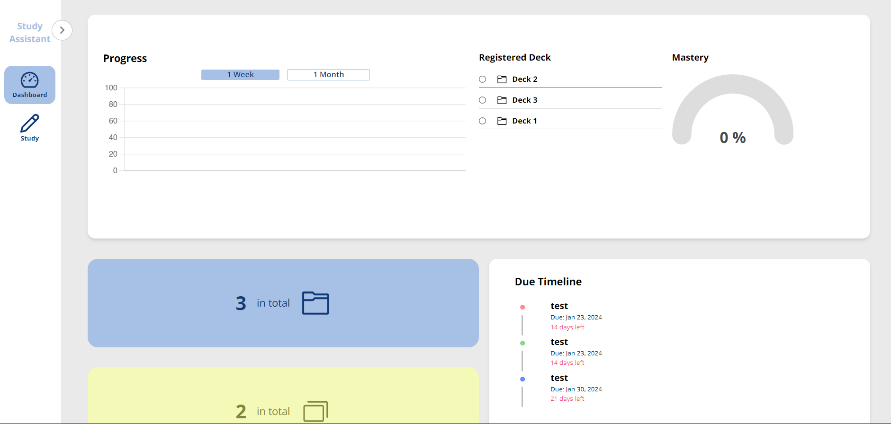
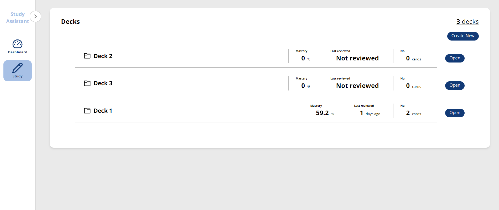
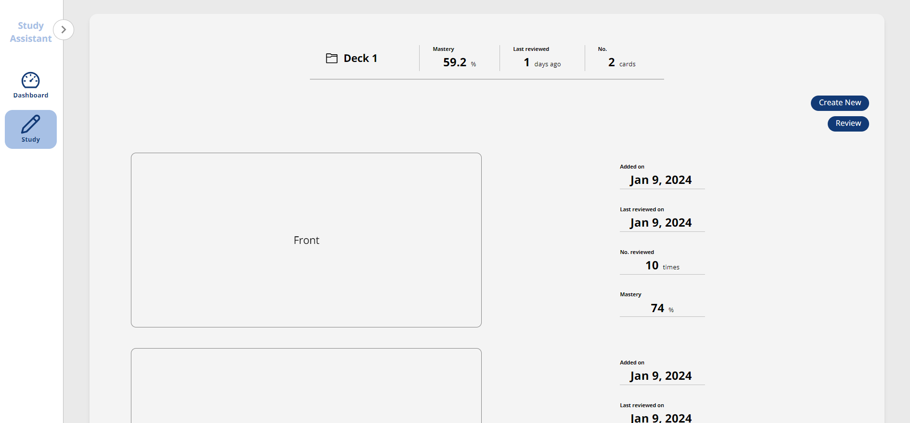

## Study Assistant
Simple Flashcard application with study progress visualization

## Functionalities
1. Flashcard
    Users have the capability to create decks and flashcards, incorporating event details for targeted study sessions. The decks list page showcases essential information including the card count, dates of the user's last review of the deck, and the mastery level achieved. On the individual deck page, users can access a comprehensive list of created cards along with detailed information such as creation dates, current mastery levels, and more.

2. Dashboard
   The Dashboard pages are divided into three sections, each of which provides users with useful information and visualized feedback on their learning progress. The Progress chart displays either week-long or month-long progress that the user has made on each deck. Users can choose which deck data to display, as well as the time range. The blue and yellow panels show how many decks and cards the user is currently studying. The Timeline panel displays upcoming events to which the user tied each deck during creation.

## Tehc Stack
Next.js, React, TypeScript, PostgreSQL, Tailwind CSS

## The app images

